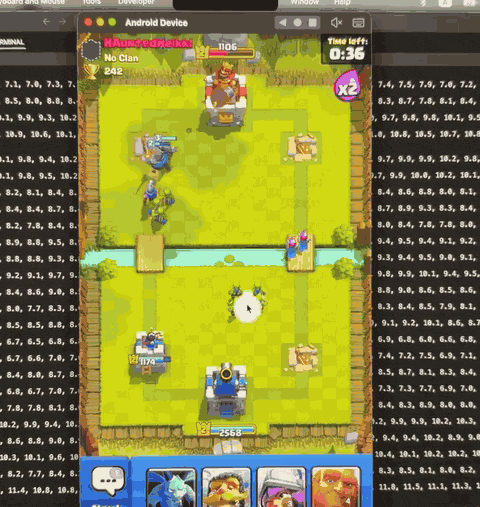
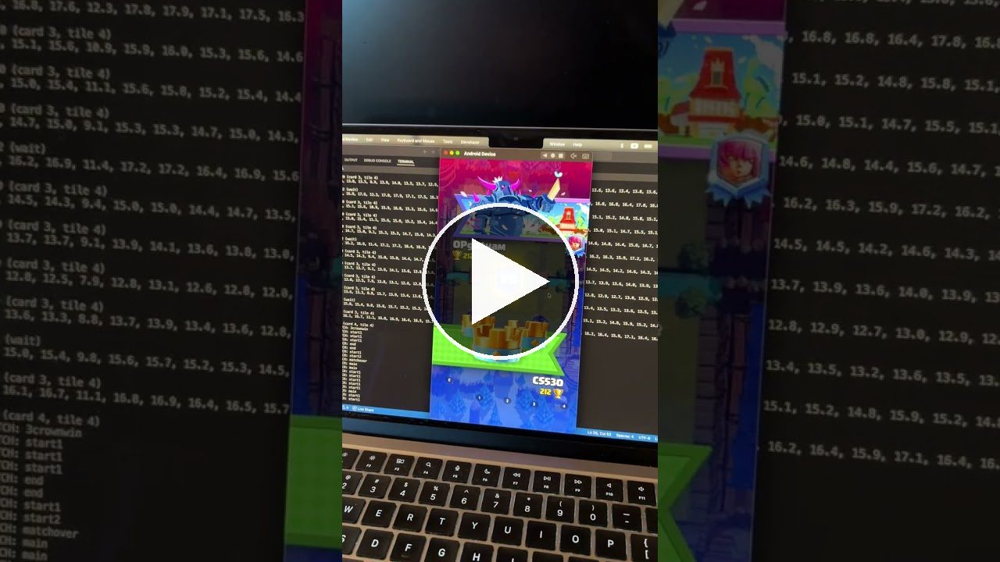

# Clash Royale Agent (Graduate AI Course Final Project)

An AI agent that autonomously plays the real Clash Royale mobile game at beginner (Arena 1) level. Since the game is proprietary and can't be run programmatically, the agent plays like a human: it perceives by taking screenshots of the game (running in the MuMuPlayer Android emulator on a MacBook Air M2) and acts by clicking with PyAutoGUI. See full details in the [final report](Principles%20of%20AI%20-%20Final%20Report.pdf).

### Demo

The agent finishing off the enemy king tower for the win, with its live state/Q-value output in the terminal on either side:

  

Full video of the 7 straight wins, with delirious commentary:

   
  <a href="https://youtu.be/S25lfXmx7i4">&#9654; Watch the full 7-win streak (22 min)</a>

### How it works

The agent runs a perception -> decision -> action loop about once per second.

- **Harness:** The game runs in the MuMuPlayer Android emulator, and the agent interacts with it exactly like a human would: each step it grabs a screenshot of the emulator window (PIL ImageGrab), and executes its chosen action as a mouse click at the corresponding screen coordinates (PyAutoGUI). The same harness also handles the menus, automatically navigating to start the next match so training and evaluation can run hands-off.
- **Perception:** Each screenshot is cropped into 13 regions and processed by the ensemble perception system. A fine-tuned YOLO26 detects troops in the arena (16 classes: 8 ally + 8 enemy), SSIM template matching identifies the current screen, the 4 cards in hand, and the elixir count (0-10), and tower HP is read via custom thresholding + EasyOCR.
- **State:** A (16, 32, 18) binary troop occupancy tensor over the arena's tile grid, plus a 39-dim flat vector (one-hot cards in hand, 6 normalized tower HPs, normalized elixir).
- **Policy:** A small CNN (~376k params) that processes the troop tensor, concatenates the result with the flat vector, and outputs Q-values over 33 discrete actions (4 card slots × 8 key placement tiles + wait).
- **Training:** The troop detector fine-tuned YOLO26 on 3,000 synthetically generated examples (random troop sprites pasted onto an empty arena with auto-derived labels), reaching 97.9% validation accuracy (mAP50 0.98). The policy was trained via double DQN: the replay buffer was pre-filled with ~2,600 steps of recorded human play (excess "wait" actions undersampled), then the agent trained hands-off for ~290 episodes (15+ hours of real gameplay), rewarded for tower HP swings and penalized for wasting or leaking elixir.

### Results

The trained agent won 7 matches in a row (2 against the built-in Trainer George bot and 5 against real human players with higher-level cards), achieving all three project goals: beating the bot, beating a human, and getting promoted to Arena 2.

## Codebase

Run scripts as modules from the repo root, e.g. `python -m src.training.train_rl` or `python -m src.agent.play_policy`.

`src/vision/` -> perception + synthetic data pipeline:

[synthetic_generation.py](src/vision/synthetic_generation.py) -> generate N synthetic data examples

[train_yolo.ipynb](src/vision/train_yolo.ipynb) -> code to fine-tune YOLO26 with synthetic data (on Google Colab free GPU)

[validate_yolo.py](src/vision/validate_yolo.py) -> quick yoink of built-in YOLO validation

[capture_images.py](src/vision/capture_images.py) -> take screenshot and crop/segment into 13 relevant regions

[perception.py](src/vision/perception.py) -> take cropped image input from capture_images.py, process with YOLO/SSIM/OCR to exact numerical state representations that policy network uses as input

`src/agent/` -> the deployed agent (perceive -> decide -> act):

[policy_network.py](src/agent/policy_network.py) -> CNN/DQN that takes in game state and Q estimates for 33 actions

[execute_action.py](src/agent/execute_action.py) -> executes an action using PyAutoGUI

[play_policy.py](src/agent/play_policy.py) -> play matches with agent policy and allat

`src/training/` -> RL training:

[environment.py](src/training/environment.py) -> Gym environment wrapper for RL training, automatic menu navigation to start new match

[replay_buffer.py](src/training/replay_buffer.py) -> replay buffer for RL training

[train_rl.py](src/training/train_rl.py) -> RL training, load recorded human data with undersampling

`src/utils/` -> utilities:

[record_data.py](src/utils/record_data.py) -> Records state + actions into data/human_data/ while human is playing on emulator

[visualize_labels.py](src/utils/visualize_labels.py) -> visualize bounding boxes + labels for synthetically generated examples

[extract_policy.py](src/utils/extract_policy.py) -> extract standalone policy weights from a training checkpoint

[plot_rewards.py](src/utils/plot_rewards.py) -> plot episodic reward curve from training log

### Files

[models/](models/) -> trained weights: YOLO troop detector, best policy, and RL training [checkpoints/](models/checkpoints/)

[data/sprites/](data/sprites/) -> all sprites for 16 troop classes (100-200 transparent pngs each), used for synthetic data generation

[data/synthetic_dataset/](data/synthetic_dataset/) -> dataset config, full dataset (3k examples) is too big for repo

[src/vision/templates/](src/vision/templates/) -> images of all cards + tower/arena states used by the perception pipeline (SSIM matching)

[data/human_data/](data/human_data/) -> recorded human data, states/ and actions/

[outputs/screenshots/](outputs/screenshots/) -> screenshots used for testing, cropping, etc

[outputs/runs/](outputs/runs/) -> auto-generated YOLO validation stats

[outputs/highlight.gif](outputs/highlight.gif) -> short demo GIF shown at the top of this README

[outputs/demo_thumbnail.jpg](outputs/demo_thumbnail.jpg) -> YouTube thumbnail with play button, links to the full demo video

[outputs/recording.gif](outputs/recording.gif) -> older raw screen recording of the agent playing

[Principles of AI - Final Report.pdf](Principles%20of%20AI%20-%20Final%20Report.pdf) -> final report
